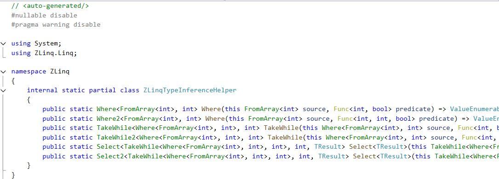
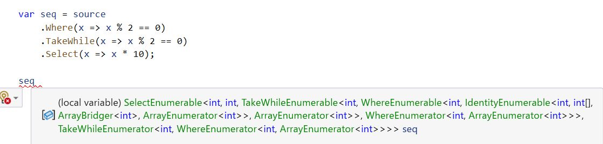
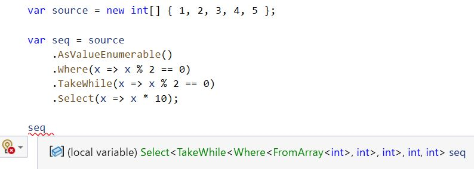

ZLinq
===
Zero allocation LINQ with Span and LINQ to SIMD, LINQ to Tree (FileSystem, Json, GameObject, etc.) for all .NET platforms and Unity.

> [!IMPORTANT]
> This library is currently in preview. Most methods are implemented, but some still throw NotImplementedException.

* 99% compatibility with .NET 10's LINQ to Objects (including Shuffle, RightJoin, LeftJoin)
* Zero allocation for method chains through struct-based Enumerable via `IValueEnumerable`
* Hybrid design with Source Generator to complement type inference
* Full support for LINQ operations on Span using .NET 9/C# 13's `allows ref struct`
* LINQ to Tree to extend tree-structured objects (built-in support for FileSystem, JSON (for System.Text.Json), GameObject (for Unity))
* Automatic application of SIMD where possible and customizable LINQ to SIMD for arbitrary operations
* Fusion of my past LINQ implementations ([linq.js](https://github.com/neuecc/linq.js/), [LINQ to GameObject](http://u3d.as/content/neuecc/linq-to-game-object), [SimdLinq](https://github.com/Cysharp/SimdLinq/), [UniRx](https://github.com/neuecc/UniRx), [R3](https://github.com/Cysharp/R3)) and zero allocation series ([ZString](https://github.com/Cysharp/ZString), [ZLogger](https://github.com/Cysharp/ZLogger))

I aimed to create not just an experimental library but a practical one. It's also designed to handle high-load requirements, such as those found in games.

You can install it from [NuGet/ZLinq](https://www.nuget.org/packages/ZLinq). For Unity usage, refer to the [Unity section](#unity).

```bash
dotnet add package ZLinq
```

ZLinq chains internally use the following interface:

```csharp
// struct version of IEnumerable<T> and IEnumerator<T>
public interface IValueEnumerable<T> : IDisposable
{
    bool TryGetNext(out T current); // as MoveNext + Current

    // Optimize options
    bool TryGetNonEnumeratedCount(out int count);
    bool TryGetSpan(out ReadOnlySpan<T> span);
    bool TryCopyTo(Span<T> destination);
}
```

Besides changing to a struct-based approach, we've integrated MoveNext and Current to reduce the number of iterator calls. Also, since structs automatically copy internal state, we've simplified the type complexity by unifying Enumerable and Enumerator.

```csharp
public static Where<TEnumerable, TSource> Where<TEnumerable, TSource>(this TEnumerable source, Func<TSource, Boolean> predicate)
    where TEnumerable : struct, IValueEnumerable<TSource>, allows ref struct
````

Operators have this method signature, but C# cannot infer types from generic constraints (in this case, determining TSource type from TEnumerable) ([dotnet/csharplang#6930](https://github.com/dotnet/csharplang/discussions/6930)). Therefore, the traditional Struct LINQ approach required implementing all operator combinations as instance methods, resulting in nearly 100,000 methods and massive assembly sizes.

ZLinq adopts a hybrid approach using Source Generator to partially convert TEnumerable to concrete types for extension methods based on usage, successfully keeping the assembly size to the minimum necessary.

<details><summary>Generated Inference Helper Code</summary>



</details>

Struct-based LINQ leads to very unreadable type names due to chained generics. For example, with [LinqAf](https://github.com/kevin-montrose/LinqAF), types look like this:

<details><summary>LinqAf IntelliSense</summary>



</details>

ZLinq has been designed with readable generated types in mind:

<details><summary>ZLinq IntelliSense</summary>



</details>

Additionally, `TryGetNonEnumeratedCount(out int count)`, `TryGetSpan(out ReadOnlySpan<T> span)`, and `TryCopyTo(Span<T> destination)` defined in the interface itself enable flexible optimizations. For example, Take+Skip can be expressed entirely as Span slices, so if the original source can be converted to a Span, Span slices are passed through TryGetSpan chains. For ToArray, if the sequence length can be calculated, a fixed-length array is prepared in advance, and operators that can write directly to the final array via TryCopyTo will do so. Some methods automatically use SIMD-based optimization if a Span can be obtained.

Gettting Started
---
Use `using ZLinq;` and call `AsValueEnumerable()` on any iterable type to use ZLinq's zero-allocation LINQ. Also, `Range`, `Repeat`, and `Empty` are defined in `ValueEnumerable`.

```csharp
using ZLinq;

var source = new int[] { 1, 2, 3, 4, 5 };

// Call AsValueEnumerable to apply ZLinq
var seq1 = source.AsValueEnumerable().Where(x => x % 2 == 0);

// Can also be applied to Span (only in .NET 9/C# 13 environments that support allows ref struct)
Span<int> span = stackalloc int[5] { 1, 2, 3, 4, 5 };
var seq2 = span.AsValueEnumerable().Select(x => x * x);
```

> Auto-completion may temporarily stop until the Source Generator completes generation. Recent versions of Visual Studio run Source Generators on save, so you may need to explicitly save or compile when operations stop. If you experience issues with the code editor, you can write in normal LINQ first, then add AsValueEnumerable(). Method signatures are almost completely compatible.

> Due to Source Generator limitations and code analysis trigger constraints, you cannot place method chains in temporary variables and continue. Except for foreach, all operators must be written in the method chain.  Also, you cannot use private visibility or anonymous types. You need to use ValueTuple or change to public/internal visibility.

LINQ to Tree
---
LINQ to XML introduced the concept of querying around axes to C#. Even if you don't use XML, similar APIs are incorporated into Roslyn and effectively used for exploring SyntaxTrees. ZLinq extends this concept to make it applicable to anything that can be considered a Tree, allowing `Ancestors`, `Children`, `Descendants`, `BeforeSelf`, and `AfterSelf` to be applied.


Specifically, by defining a struct that implements the following interface, it becomes iterable:

```csharp
public interface ITraversable<TTraversable, T> : IDisposable
    where TTraversable : struct, ITraversable<TTraversable, T> // self
{
    T Origin { get; }
    TTraversable ConvertToTraversable(T next); // for Descendants
    bool TryGetHasChild(out bool hasChild); // optional: optimize use for Descendants
    bool TryGetChildCount(out int count);   // optional: optimize use for Children
    bool TryGetParent(out T parent); // for Ancestors
    bool TryGetNextChild(out T child); // for Children | Descendants
    bool TryGetNextSibling(out T next); // for AfterSelf
    bool TryGetPreviousSibling(out T previous); // BeforeSelf
}
```

Standard packages are available for FileSystemInfo and JsonNode. For Unity, it's applicable to GameObject and Transform.

### FileSystem

```bash
dotnet add package ZLinq.FileSystem
```

```csharp
using ZLinq;

var root = new DirectoryInfo("C:\\Program Files (x86)\\Steam");

// FileSystemInfo(FileInfo/DirectoryInfo) can call `Ancestors`, `Children`, `Descendants`, `BeforeSelf`, `AfterSelf`
var groupByName = root.Descendants()
    .OfType(default(FileInfo))
    .Where(x => x.Extension == ".dll")
    .GroupBy(x => x.Name)
    .Select(x => (FileName: x.Key, Count: x.Count()))
    .OrderByDescending(x => x.Count);

foreach (var item in groupByName)
{
    Console.WriteLine(item);
}
```

### JSON(System.Text.Json)

```bash
dotnet add package ZLinq.Json
```

```csharp
using ZLinq;

// System.Text.Json's JsonNode is the target of LINQ to JSON(not JsonDocument/JsonElement).
var json = JsonNode.Parse("""
{
    "nesting": {
      "level1": {
        "description": "First level of nesting",
        "value": 100,
        "level2": {
          "description": "Second level of nesting",
          "flags": [true, false, true],
          "level3": {
            "description": "Third level of nesting",
            "coordinates": {
              "x": 10.5,
              "y": 20.75,
              "z": -5.0
            },
            "level4": {
              "description": "Fourth level of nesting",
              "metadata": {
                "created": "2025-02-15T14:30:00Z",
                "modified": null,
                "version": 2.1
              },
              "level5": {
                "description": "Fifth level of nesting",
                "settings": {
                  "enabled": true,
                  "threshold": 0.85,
                  "options": ["fast", "accurate", "balanced"],
                  "config": {
                    "timeout": 30000,
                    "retries": 3,
                    "deepSetting": {
                      "algorithm": "advanced",
                      "parameters": [1, 1, 2, 3, 5, 8, 13]
                    }
                  }
                }
              }
            }
          }
        }
      }
    }
}
""");

// JsonNode
var origin = json!["nesting"]!["level1"]!["level2"]!;

// JsonNode axis, Children, Descendants, Anestors, BeforeSelf, AfterSelf and ***Self.
foreach (var item in origin.Descendants().Select(x => x.Node).OfType(default(JsonArray)))
{
    // [true, false, true], ["fast", "accurate", "balanced"], [1, 1, 2, 3, 5, 8, 13]
    Console.WriteLine(item!.ToJsonString(JsonSerializerOptions.Web));
}
```

### GameObject/Transfrom(Unity)

see: [unity](#unity) section.

LINQ to SIMD
---
WIP

Unity
---
The minimum supported Unity version will be `2022.3.12f1`, as it is necessary to support C# Incremental Source Generator(Compiler Version, 4.3.0).

There are two installation steps required to use it in Unity.

1. Install `ZLinq` from NuGet using [NuGetForUnity](https://github.com/GlitchEnzo/NuGetForUnity)
Open Window from NuGet -> Manage NuGet Packages, Search "ZLinq" and Press Install. 

2. Install the `ZLinq.Unity` package by referencing the git URL  
> https://github.com/Cysharp/ZLinq.git?path=src/ZLinq.Unity/Assets/ZLinq.Unity

With the help of the Unity package, in addition to the standard ZLinq, LINQ to GameObject functionality becomes available for exploring GameObject/Transform.


```csharp
using ZLinq;

public class SampleScript : MonoBehaviour
{
    public Transform Origin;

    void Start()
    {
        Debug.Log("Ancestors--------------");  // Container, Root
        foreach (var item in Origin.Ancestors()) Debug.Log(item.name);

        Debug.Log("Children--------------"); // Sphere_A, Sphere_B, Group, Sphere_A, Sphere_B
        foreach (var item in Origin.Children()) Debug.Log(item.name);

        Debug.Log("Descendants--------------"); // Sphere_A, Sphere_B, Group, P1, Group, Sphere_B, P2, Sphere_A, Sphere_B
        foreach (var item in Origin.Descendants()) Debug.Log(item.name);

        Debug.Log("BeforeSelf--------------"); // C1, C2
        foreach (var item in Origin.BeforeSelf()) Debug.Log(item.name);

        Debug.Log("AfterSelf--------------");  // C3, C4
        foreach (var item in Origin.AfterSelf()) Debug.Log(item.name);
    }
}
```

You can chain query(LINQ to Objects). Also, you can filter by component using the `OfComponent<T>` helper.

```csharp
// all filtered(tag == "foobar") objects
var foobars = root.Descendants().Where(x => x.tag == "foobar");

// get FooScript under self childer objects and self
var fooScripts = root.ChildrenAndSelf().OfComponent<FooScript>(); 
```

License
---
This library is under MIT License.
