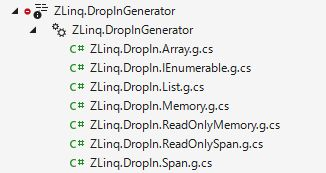
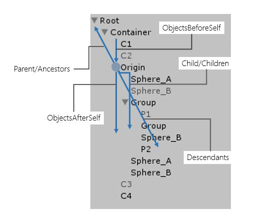
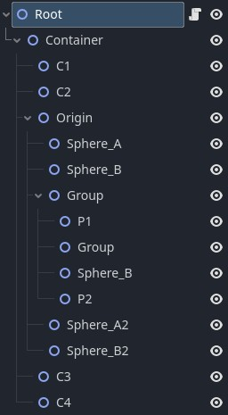

ZLinq
===
Zero allocation LINQ with Span and LINQ to SIMD, LINQ to Tree (FileSystem, Json, GameObject, etc.) for all .NET platforms(netstandard2.0, 2.1, net8, net9) and Unity, Godot.

> [!IMPORTANT]
> This library is currently in preview. All methods have been implemented, but testing is not complete so operation is not guaranteed.
The official release will be soon, but please wait until then for official use in production.


```csharp
using ZLinq;

var seq = source
    .AsValueEnumerable() // only add this line
    .Where(x => x % 2 == 0)
    .Select(x => x * 3);

foreach (var item in seq) { }
```

* **99% compatibility** with .NET 10's LINQ (including new `Shuffle`, `RightJoin`, `LeftJoin` operators)
* **Zero allocation** for method chains through struct-based Enumerable via `ValueEnumerable`
* Full support for LINQ operations on **Span** using .NET 9/C# 13's `allows ref struct`
* **LINQ to Tree** to extend tree-structured objects (built-in support for FileSystem, JSON, GameObject)
* Automatic application of SIMD where possible and customizable **LINQ to SIMD** for arbitrary operations
* Optional **Drop-in replacement** Source Generator to automatically accelerate all LINQ methods
* Fusion of my past LINQ ([linq.js](https://github.com/neuecc/linq.js/), [SimdLinq](https://github.com/Cysharp/SimdLinq/), [UniRx](https://github.com/neuecc/UniRx), [R3](https://github.com/Cysharp/R3)) and zero alloc  ([ZString](https://github.com/Cysharp/ZString), [ZLogger](https://github.com/Cysharp/ZLogger)) impls

I aimed to create not just an experimental library but a practical one. It's also designed to handle high-load requirements, such as those found in games.

You can install it from [NuGet/ZLinq](https://www.nuget.org/packages/ZLinq). For Unity usage, refer to the [Unity section](#unity). For Godot usage, refer to the [Godot section](#godot).

```bash
dotnet add package ZLinq
```

ZLinq chains internally use the following interface:

```csharp
public readonly ref struct ValueEnumerable<TEnumerator, T>(TEnumerator enumerator)
    where TEnumerator : struct, IValueEnumerator<T>, allows ref struct
{
    public readonly TEnumerator Enumerator = enumerator;
}

public interface IValueEnumerator<T> : IDisposable
{
    bool TryGetNext(out T current); // as MoveNext + Current

    // Optimization helper
    bool TryGetNonEnumeratedCount(out int count);
    bool TryGetSpan(out ReadOnlySpan<T> span);
    bool TryCopyTo(Span<T> destination, Index offset);
}
```

Besides changing to a struct-based approach, we've integrated MoveNext and Current to reduce the number of iterator calls. Also, since structs automatically copy internal state, we've simplified the type complexity by unifying Enumerable and Enumerator(almostly types only implements custom enumerator).

```csharp
public static ValueEnumerable<Where<TEnumerator, TSource>, TSource> Where<TEnumerator, TSource>(in this ValueEnumerable<TEnumerator, TSource> source, Func<TSource, Boolean> predicate)
    where TEnumerator : struct, IValueEnumerator<TSource>, allows ref struct
````

Operators have this method signature. C# cannot infer types from generic constraints([dotnet/csharplang#6930](https://github.com/dotnet/csharplang/discussions/6930)). Therefore, the traditional Struct LINQ approach required implementing all operator combinations as instance methods, resulting in [100,000+ methods and massive assembly sizes](https://kevinmontrose.com/2018/01/17/linqaf-replacing-linq-and-not-allocating/). However, in ZLinq, we've successfully avoided all the boilerplate method implementations by devising an approach that properly conveys types to C# compiler. There are approaches focusing on instance methods to aim for local maximum performance, or generating everything with Source Generator, but ZLinq style has been chosen to balance usability with assembly size and other factors.

Additionally, `TryGetNonEnumeratedCount(out int count)`, `TryGetSpan(out ReadOnlySpan<T> span)`, and `TryCopyTo(Span<T> destination)` defined in the interface itself enable flexible optimizations. For example, Take+Skip can be expressed entirely as Span slices, so if the original source can be converted to a Span, Span slices are passed through TryGetSpan chains. For ToArray, if the sequence length can be calculated, a fixed-length array is prepared in advance, and operators that can write directly to the final array via TryCopyTo will do so. Some methods automatically use SIMD-based optimization if a Span can be obtained.

Gettting Started
---
Use `using ZLinq;` and call `AsValueEnumerable()` on any iterable type to use ZLinq's zero-allocation LINQ. Also, `Range`, `Repeat`, and `Empty` are defined in `ValueEnumerable`.

```csharp
using ZLinq;

var source = new int[] { 1, 2, 3, 4, 5 };

// Call AsValueEnumerable to apply ZLinq
var seq1 = source.AsValueEnumerable().Where(x => x % 2 == 0);

// Can also be applied to Span (only in .NET 9/C# 13 environments that support allows ref struct)
Span<int> span = stackalloc int[5] { 1, 2, 3, 4, 5 };
var seq2 = span.AsValueEnumerable().Select(x => x * x);
```

Drop-in replacement
---
When introducing `ZLinq.DropInGenerator`, you can automatically use ZLinq for all LINQ methods without calling `AsValueEnumerable()`.

```bash
dotnet add package ZLinq.DropInGenerator
```



It works by using a Source Generator to add extension methods for each type that take priority, making `ZLinq` methods be selected instead of System.Linq when the same name and arguments are used. 
After installing the package, you need to configure it with an assembly attribute.

```csharp
[assembly: ZLinq.ZLinqDropInAttribute("ZLinq.DropIn", ZLinq.DropInGenerateTypes.Array)]
```

`generateNamespace` is the namespace for the generated code, and `DropInGenerateTypes` selects the target types. 
`DropInGenerateTypes` allows you to choose from `Array`, `Span` (Span/ReadOnlySpan), `Memory` (Memory/ReadOnlyMemory), `List`, and `Enumerable` (IEnumerable). 
These are Flags, so you can combine them, such as `DropInGenerateTypes.Array | DropInGenerateTypes.Span`. 
There are also predefined combinations: `Collection = Array | Span | Memory | List` and `Everything = Array | Span | Memory | List | Enumerable`.

You can enable it for all files by global using the generated namespace:

```csharp
global using ZLinq.Dropin;
```

When using `DropInGenerateTypes.Enumerable`, which generates extension methods for `IEnumerable<T>`, you need to make `generateNamespace` global as a namespace priority. 
For example:

```csharp
[assembly: ZLinq.ZLinqDropInAttribute("", ZLinq.DropInGenerateTypes.Everything)]
```

This is the most aggressive configuration, causing all LINQ methods to be processed by ZLinq, and making it impossible to use normal LINQ methods (if Enumerable is not included, you can call AsEnumerable() to execute with System.Linq).

While ZLinq offers superior performance, there are some differences from System.Linq. 
For instance, be aware that you cannot store it in fields or pass it as method arguments. 
For example, you cannot pass LINQ operations to `string.Join`. 
In such cases, you need to use `ToArray` (if you want to minimize allocations, you can use `ToArrayPool` and return it to the Pool after the Join operation).

> I recommend considering `Everything` to have too strong of side effects, so it would be better to try using namespaces and `DropInGenerateTypes.Collection`.

Other options for `ZLinqDropInAttribute` include `GenerateAsPublic`, `ConditionalCompilationSymbols`, and `DisableEmitSource`.

LINQ to Tree
---
LINQ to XML introduced the concept of querying around axes to C#. Even if you don't use XML, similar APIs are incorporated into Roslyn and effectively used for exploring SyntaxTrees. ZLinq extends this concept to make it applicable to anything that can be considered a Tree, allowing `Ancestors`, `Children`, `Descendants`, `BeforeSelf`, and `AfterSelf` to be applied.



Specifically, by defining a struct that implements the following interface, it becomes iterable:

```csharp
public interface ITraverser<TTraverser, T> : IDisposable
    where TTraverser : struct, ITraverser<TTraverser, T> // self
{
    T Origin { get; }
    TTraverser ConvertToTraverser(T next); // for Descendants
    bool TryGetHasChild(out bool hasChild); // optional: optimize use for Descendants
    bool TryGetChildCount(out int count);   // optional: optimize use for Children
    bool TryGetParent(out T parent); // for Ancestors
    bool TryGetNextChild(out T child); // for Children | Descendants
    bool TryGetNextSibling(out T next); // for AfterSelf
    bool TryGetPreviousSibling(out T previous); // BeforeSelf
}
```

Standard packages are available for FileSystemInfo and JsonNode. For Unity, it's applicable to GameObject and Transform.

### FileSystem

```bash
dotnet add package ZLinq.FileSystem
```

```csharp
using ZLinq;

var root = new DirectoryInfo("C:\\Program Files (x86)\\Steam");

// FileSystemInfo(FileInfo/DirectoryInfo) can call `Ancestors`, `Children`, `Descendants`, `BeforeSelf`, `AfterSelf`
var allDlls = root
    .Descendants()
    .OfType<FileInfo>()
    .Where(x => x.Extension == ".dll");

var grouped = allDlls
    .GroupBy(x => x.Name)
    .Select(x => new { FileName = x.Key, Count = x.Count() })
    .OrderByDescending(x => x.Count);

foreach (var item in grouped)
{
    Console.WriteLine(item);
}
```

### JSON(System.Text.Json)

```bash
dotnet add package ZLinq.Json
```

```csharp
using ZLinq;

// System.Text.Json's JsonNode is the target of LINQ to JSON(not JsonDocument/JsonElement).
var json = JsonNode.Parse("""
{
    "nesting": {
      "level1": {
        "description": "First level of nesting",
        "value": 100,
        "level2": {
          "description": "Second level of nesting",
          "flags": [true, false, true],
          "level3": {
            "description": "Third level of nesting",
            "coordinates": {
              "x": 10.5,
              "y": 20.75,
              "z": -5.0
            },
            "level4": {
              "description": "Fourth level of nesting",
              "metadata": {
                "created": "2025-02-15T14:30:00Z",
                "modified": null,
                "version": 2.1
              },
              "level5": {
                "description": "Fifth level of nesting",
                "settings": {
                  "enabled": true,
                  "threshold": 0.85,
                  "options": ["fast", "accurate", "balanced"],
                  "config": {
                    "timeout": 30000,
                    "retries": 3,
                    "deepSetting": {
                      "algorithm": "advanced",
                      "parameters": [1, 1, 2, 3, 5, 8, 13]
                    }
                  }
                }
              }
            }
          }
        }
      }
    }
}
""");

// JsonNode
var origin = json!["nesting"]!["level1"]!["level2"]!;

// JsonNode axis, Children, Descendants, Anestors, BeforeSelf, AfterSelf and ***Self.
foreach (var item in origin.Descendants().Select(x => x.Node).OfType<JsoArray>())
{
    // [true, false, true], ["fast", "accurate", "balanced"], [1, 1, 2, 3, 5, 8, 13]
    Console.WriteLine(item.ToJsonString(JsonSerializerOptions.Web));
}
```

### GameObject/Transfrom(Unity)

see: [unity](#unity) section.

LINQ to SIMD
---
WIP

Unity
---
The minimum supported Unity version will be `2022.3.12f1`, as it is necessary to support C# Incremental Source Generator(Compiler Version, 4.3.0).

There are two installation steps required to use it in Unity.

1. Install `ZLinq` from NuGet using [NuGetForUnity](https://github.com/GlitchEnzo/NuGetForUnity)  
Open Window from NuGet -> Manage NuGet Packages, Search "ZLinq" and Press Install. 

2. Install the `ZLinq.Unity` package by referencing the git URL  

```bash
https://github.com/Cysharp/ZLinq.git?path=src/ZLinq.Unity/Assets/ZLinq.Unity
```

With the help of the Unity package, in addition to the standard ZLinq, LINQ to GameObject functionality becomes available for exploring GameObject/Transform.


```csharp
using ZLinq;

public class SampleScript : MonoBehaviour
{
    public Transform Origin;

    void Start()
    {
        Debug.Log("Ancestors--------------");  // Container, Root
        foreach (var item in Origin.Ancestors()) Debug.Log(item.name);

        Debug.Log("Children--------------"); // Sphere_A, Sphere_B, Group, Sphere_A, Sphere_B
        foreach (var item in Origin.Children()) Debug.Log(item.name);

        Debug.Log("Descendants--------------"); // Sphere_A, Sphere_B, Group, P1, Group, Sphere_B, P2, Sphere_A, Sphere_B
        foreach (var item in Origin.Descendants()) Debug.Log(item.name);

        Debug.Log("BeforeSelf--------------"); // C1, C2
        foreach (var item in Origin.BeforeSelf()) Debug.Log(item.name);

        Debug.Log("AfterSelf--------------");  // C3, C4
        foreach (var item in Origin.AfterSelf()) Debug.Log(item.name);
    }
}
```

You can chain query(LINQ to Objects). Also, you can filter by component using the `OfComponent<T>` helper.

```csharp
// all filtered(tag == "foobar") objects
var foobars = root.Descendants().Where(x => x.tag == "foobar");

// get FooScript under self childer objects and self
var fooScripts = root.ChildrenAndSelf().OfComponent<FooScript>(); 
```

In .NET 9, `ValueEnumerable` is a `ref struct`, so it cannot be converted to `IEnumerable<T>`. However, in Unity it's a regular `struct`, making it possible to convert to `IEnumerable<T>`. You can improve interoperability by preparing an extension method like this:

```csharp
public static class ZLinqExtensions
{
    public static IEnumerable<T> AsEnumerable<TEnumerator, T>(this ValueEnumerable<TEnumerator, T> valueEnumerable)
        where TEnumerator : struct, IValueEnumerator<T>
    {
        using (var e = valueEnumerable.Enumerator)
        {
            while (e.TryGetNext(out var current))
            {
                yield return current;
            }
        }
    }
}
```

Godot
---
The minimum supported Godot version will be `4.0.0`.
You can install ZLinq.Godot package via NuGet.

```bash
dotnet add package ZLinq.Godot
```

In addition to the standard ZLinq, LINQ to Node functionality is available.



```csharp
using Godot;
using ZLinq;

public partial class SampleScript : Node2D
{
    public override void _Ready()
    {
        var origin = GetNode<Node2D>("Container/Origin");

        GD.Print("Ancestors--------------"); // Container, Root, root (Root Window)
        foreach (var item in origin.Ancestors()) GD.Print(item.Name);

        GD.Print("Children--------------"); // Sphere_A, Sphere_B, Group, Sphere_A, Sphere_B
        foreach (var item in origin.Children()) GD.Print(item.Name);

        GD.Print("Descendants--------------"); // Sphere_A, Sphere_B, Group, P1, Group, Sphere_B, P2, Sphere_A, Sphere_B
        foreach (var item in origin.Descendants()) GD.Print(item.Name);

        GD.Print("BeforeSelf--------------"); // C1, C2
        foreach (var item in origin.BeforeSelf()) GD.Print(item.Name);

        GD.Print("AfterSelf--------------"); // C3, C4
        foreach (var item in origin.AfterSelf()) GD.Print(item.Name);
    }
}

```

You can chain query(LINQ to Objects). Also, you can filter by node type using the `OfType()`.

```csharp
// get ancestors under a Window
var ancestors = root.Ancestors().TakeWhile(x => x is not Window);
// get FooScript under self childer objects and self
var fooScripts = root.ChildrenAndSelf().OfType(default(FooScript));
```

Acknowledgement
---
Since the preview version release, we have received multiple ideas for fundamental interface revisions leading to performance improvements from [@Akeit0](https://github.com/Akeit0), and test and benchmark infrastructure from [@filzrev](https://github.com/filzrev). We are grateful for their many contributions.

License
---
This library is under MIT License.
