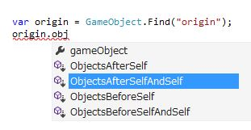

LINQ to GameObject
===
LINQ to GameObject is GameObject extensions for Unity that allows traverse hierarchy and append GameObject like LINQ to XML. You can install from [Unity Asset Store - LINQ to GameObject](http://u3d.as/content/neuecc/linq-to-game-object) as FREE. Unity Forums support thread, ask me any questions - [http://forum.unity3d.com/threads/linq-to-gameobject.292611/](http://forum.unity3d.com/threads/linq-to-gameobject.292611/)

LINQ to GameObject supports Unity 5 and uGUI's `RectTransform`.

Axis
---
The concept of LINQ to GameObject is axis on tree.


Every traverse method returns `IEnumerable<GameObject>` and deferred exectuion. For example

```csharp
origin.Ancestors();   // Container, Root
origin.Children();    // Sphere_A, Sphere_B, Group, Sphere_A, Sphere_B
origin.Descendants(); // Sphere_A, Sphere_B, Group, P1, Group, Sphere_B, P2, Sphere_A, Sphere_B
origin.BeforeSelf(); // C1, C2
origin.AfterSelf();  // C3, C4
```

You can chain query(LINQ to Objects) and use some specified methods(`Destroy`, `OfComponent` and others).

```csharp
// destroy all filtered(tag == "foobar") objects
root.Descendants().Where(x => x.tag == "foobar").Destroy();

// destroy all cloned objects
origin.transform.root.gameObject
    .Descendants()
    .Where(x => x.name.EndsWith("(Clone)"))
    .Destroy();

// get FooScript under self childer objects and self
var fooScripts = root.ChildrenAndSelf().OfComponent<FooScript>(); 
```

How to use
---
Import LINQ to GameObject from Unity Asset Store - [http://u3d.as/content/neuecc/linq-to-game-object](http://u3d.as/content/neuecc/linq-to-game-object).

All methods are extension of GameObject, using `Unity.Linq` then you can use all extension methods.

```csharp
using Unity.Linq;
```


Operate
---
LINQ to GameObject have several operate methods, append child(`Add`, `AddFirst`, `AddBeforeSelf`, `AddAfterSelf`), append multiple objects(`AddRange`, `AddFirstRange`, `AddBeforeSelfRange`, `AddAfterSelfRange`) and destroy object(`Destroy`).


```csharp
var root = GameObject.Find("root"); 
var cube = Resources.Load("Prefabs/PrefabCube") as GameObject; 

// add do attach parent, set same layer and fix localPosition/Scale/Rotation.
// added child is cloned and returns child object.
var clone = root.Add(cube);

// choose sibling position and allow append multiple objects.
var clones = root.AddAfterSelfRange(new[] { cube, cube, cube });  

// destroy do check null.
root.Destroy();
```

Add method's child is cloned. It is useful for instantiate prefab scenario. If you want to move only child, you can use(`MoveToLast`, `MoveToFirst`, `MoveToBeforeSelf`, `MoveToAfterSelf`) and (`MoveToLastRange`, `MoveToFirstRange`, `MoveToBeforeSelfRange`, `MoveToAfterSelfRange`) instead of Add.

All operate methods are extension methods of GameObject, too. You need `using Unity.Linq`.

Reference : Traverse
---
All traverse methods can find inactive object. If not found, return type is `GameObject` methods return null, return type is `IEnumerable<GameObject>` methods return empty sequence. All collection methods have `string name` overload that returns filtered collection that have a matching name are included in the collection.

Method | Description 
-------| -----------
Parent|Gets the parent GameObject of this GameObject. If this GameObject has no parent, returns null.
Child|Gets the first child GameObject with the specified name. If there is no GameObject with the speficided name, returns null.
Children|Returns a collection of the child GameObjects.
ChildrenAndSelf|Returns a collection of GameObjects that contain this GameObject, and the child GameObjects.
Ancestors|Returns a collection of the ancestor GameObjects of this GameObject.
AncestorsAndSelf|Returns a collection of GameObjects that contain this element, and the ancestors of this GameObject.
Descendants|Returns a collection of the descendant GameObjects.
DescendantsAndSelf|Returns a collection of GameObjects that contain this GameObject, and all descendant GameObjects of this GameObject.
BeforeSelf|Returns a collection of the sibling GameObjects before this GameObject.
BeforeSelfAndSelf|Returns a collection of GameObjects that contain this GameObject, and the sibling GameObjects before this GameObject.
AfterSelf|Returns a collection of the sibling GameObjects after this GameObject.
AfterSelfAndSelf|Returns a collection of GameObjects that contain this GameObject, and the sibling GameObjects after this GameObject.

Reference : Operate
---
Operate methods have four optional parameter. `cloneType` configure cloned child GameObject's localPosition/Scale/Rotation, default copies original local transform. `setActive` configure activates/deactivates child GameObject. If null, doesn't set specified value. `specifiedName` configure set name of child GameObject. If null, doesn't set specified value. `setLayer` configure set child GameObject's layer same with parent, default doesn't set layer.

Method | Description 
-------| -----------
Add|Adds the GameObject/Component as children of this GameObject. Target is cloned.
AddRange|Adds the GameObject/Component as children of this GameObject. Target is cloned.
AddFirst|Adds the GameObject/Component as the first children of this GameObject. Target is cloned.
AddFirstRange|Adds the GameObject/Component as the first children of this GameObject. Target is cloned.
AddBeforeSelf|Adds the GameObject/Component before this GameObject. Target is cloned.
AddBeforeSelfRange|Adds the GameObject/Component before this GameObject. Target is cloned.
AddAfterSelf|Adds the GameObject/Component after this GameObject. Target is cloned.
AddAfterSelfRange|Adds the GameObject/Component after this GameObject. Target is cloned.
Destroy|Destroy this GameObject safety(check null).

There are `TransformCloneType` that used Add methods.

> If target is `RectTransform` always use `SetParent(parent, false)` and ignores `TransformCloneType`

Value|Description
-------| -----------
KeepOriginal|Set to same as Original. This is default of Add methods.
FollowParent|Set to same as Parent.
Origin|Set to Position = zero, Scale = one, Rotation = identity.
DoNothing|Position/Scale/Rotation as is.

MoveTo methods similar with Add but don't clone target.

Method | Description 
-------| -----------
MoveToLast|Move the GameObject/Component as children of this GameObject. 
MoveToLastRange|Move the GameObject/Component as children of this GameObject. 
MoveToFirst|Move the GameObject/Component as the first children of this GameObject. 
MoveToFirstRange|Move the GameObject/Component as the first children of this GameObject. 
MoveToBeforeSelf|Move the GameObject/Component before this GameObject. 
MoveToBeforeSelfRange|Move the GameObject/Component before this GameObject. 
MoveToAfterSelf|Move the GameObject/Component after this GameObject. 
MoveToAfterSelfRange|Move the GameObject/Component after this GameObject. 

There are `TransformMoveType` that used MoveTo methods.

> If target is `RectTransform` always use `SetParent(parent, false)` and ignores `TransformMoveType`

Value|Description
-------| -----------
FollowParent|Set to same as Parent.
Origin|Set to Position = zero, Scale = one, Rotation = identity.
DoNothing|Position/Scale/Rotation as is. This is default of MoveTo methods.          

Reference : Extensions
---
`IEnumerable<GameObject>` Extensions. If multiple GameObjects in the source collection have the same GameObject will be included multiple times in the result collection. To avoid this, use the `Distinct`(LINQ to Objects) method.

Method|Description
-------|-----------
Ancestors|Returns a collection of GameObjects that contains the ancestors of every GameObject in the source collection.
AncestorsAndSelf|Returns a collection of GameObjects that contains every GameObject in the source collection, and the ancestors of every GameObject in the source collection.
Descendants|Returns a collection of GameObjects that contains the descendant GameObjects of every GameObject in the source collection.
DescendantsAndSelf|Returns a collection of GameObjects that contains every GameObject in the source collection, and the descendent GameObjects of every GameObject in the source collection.
Children|Returns a filtered collection of the child GameObjects of every GameObject in the source collection. Only GameObjects that have a matching name are included in the collection.
ChildrenAndSelf|Returns a collection of GameObjects that contains every GameObject in the source collection, and the child GameObjects of every GameObject in the source collection.
Destroy|Destroy every GameObject in the source collection safety(check null).
OfComponent|Returns a collection of specified component in the source collection.

Performance Tips
---
If you can use native methods(such as GetComponentsInChildren), it is always fast than LINQ traverse(because LINQ traverse is simple for-loop, no native magics). So you can substitude native methods, use it. If you needs complex query, use LINQ.

Tips for gc reduction, you can define ToList extension like `void GetComponentsInChildren<T>(List<T> results)` and reuse `List<T>`.

```csharp
public static class EnumerableExtensions
{
    public static int ToArrayNonAlloc<T>(this IEnumerable<T> source, ref T[] array)
    {
        var index = 0;
        foreach (var item in source)
        {
            if (array.Length == index)
            {
                var newSize = (index == 0) ? 4 : index * 2;
                Array.Resize(ref array, newSize);
            }
            array[index++] = item;
        }

        return index;
    }

    public static void ToListNonAlloc<T>(this IEnumerable<T> source, ref List<T> list)
    {
        list.Clear();
        foreach (var item in source)
        {
            list.Add(item);
        }
    }
}
```

Author Info
---
Yoshifumi Kawai(a.k.a. neuecc) is software developer in Japan.  
He is Director/CTO at Grani, Inc.  
Grani is top social game developer in Japan.   
He awarded Microsoft MVP for Visual C# since 2011.  
He is known by creator of [linq.js](http://linqjs.codeplex.com/)(LINQ to Objects for JavaScript) and [UniRx](https://github.com/neuecc/UniRx)(Reactive Extensions for Unity)

Blog: http://neue.cc/ (JPN)  
Twitter: https://twitter.com/neuecc (JPN)

License
---
This library is under MIT License.
